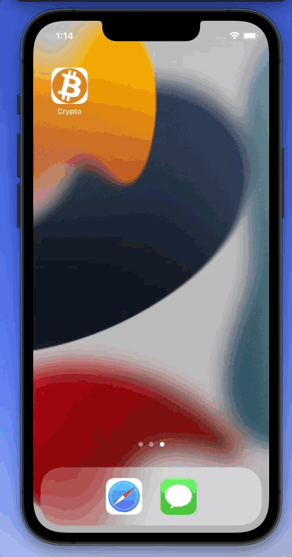

# Crypto 💲
    

## DEMO
This project is a cryptocurrency app that uses API to show information.  
  

## APP DESIGN
This app contains only 1 screen.  
User see a big table with all the coins fetched from the API.  
With help of SegemntedController user can switch wich kind of filter wants to apply.  
Besides of that there is possibility to search for specifing coin using texfield.  

## TECHNICAL ASPECTS
This app is written using MVC design pattern.  
Flow of the data si controlled via RxSwift.  
Whole UI have been made form code without storyboards.  

## REQUAIRMENTS 📄
- iOS 15.0+
- Xcode 13.1

     
Made with ♥️ in Swift.
